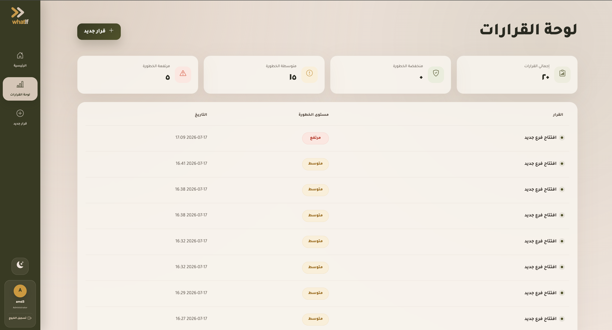
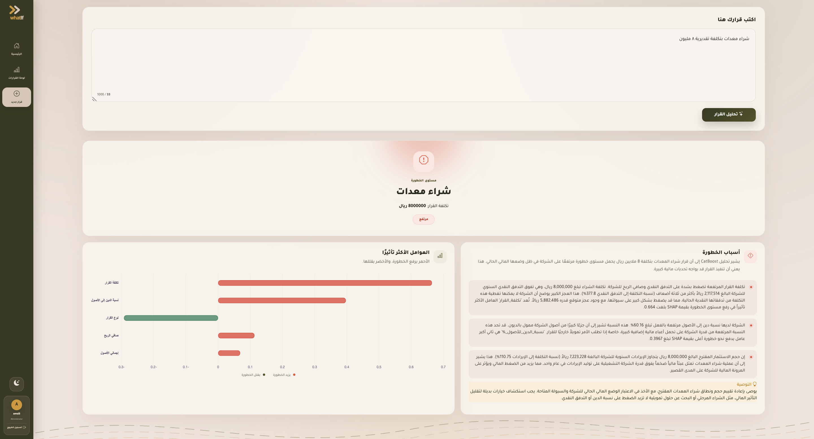

<div align="center">

# WhatIf

### AI-Powered Financial Decision Support Platform

Evaluate financial decisions before execution using **LLMs**, **Machine Learning**, and **Explainable AI**.

<p>

</p>

</div>

---

# About

**WhatIf** is an AI-powered financial decision support platform designed to help organizations evaluate high-impact financial decisions before execution.

Instead of manually reviewing financial reports and spreadsheets, users simply describe a decision in natural language.

The platform automatically:

- Understands the decision using an LLM.
- Extracts key financial information.
- Predicts the financial risk.
- Explains why the prediction was made.
- Provides transparent insights that support confident decision-making.

---

# Key Features

| | |
|:--|:--|
|  **Natural Language Understanding** | Analyze financial decisions written in natural language. |
|  **Risk Prediction** | Predict risk using a CatBoost machine learning model. |
|  **Explainable AI** | Explain every prediction with SHAP. |
|  **Decision Dashboard** | View previous analyses and overall statistics. |
|  **Authentication** | Secure user login and personal decision history. |
|  **Decision Support** | Provide recommendations when high-risk decisions are detected. |

---

# Workflow

```text
Financial Decision
        │
        ▼
Large Language Model
        │
        ▼
Decision & Cost Extraction
        │
        ▼
Financial Feature Engineering
        │
        ▼
CatBoost Risk Prediction
        │
        ▼
SHAP Explainability
        │
        ▼
AI Explanation
        │
        ▼
Decision Support
```

---

# Screenshots

## Landing Page


The landing page provides a quick overview of the platform and allows users to start a new analysis or access previous decisions.

---

## Dashboard



The dashboard summarizes previous financial decisions, displays overall statistics, and provides users with a complete history of analyzed decisions.

---

## AI Decision Analysis



After entering a financial decision, the platform:

- Extracts the decision information.
- Predicts the risk level.
- Explains the prediction with SHAP.
- Highlights the most influential financial indicators.
- Presents AI-generated financial insights.
- Recommends lower-risk alternatives when applicable.

---

# Technologies

### Backend

- Django
- Python

### Machine Learning

- CatBoost
- SHAP
- Scikit-learn
- Pandas

### Artificial Intelligence

- Google GenAI SDK (LLM)

### Frontend

- HTML
- CSS
- JavaScript

### Database

- SQLite

---

# Project Structure

```text
WhatIf
│
├── accounts
│   └── User authentication
│
├── ml_app
│   ├── AI pipeline
│   ├── Risk prediction
│   ├── SHAP explainability
│   ├── Dashboard
│   └── Business logic
│
├── whatif
│   └── Django configuration
│
├── manage.py
└── requirements.txt
```

---

## Future Enhancements

- Train and validate the platform using anonymized real financial data to improve prediction accuracy and reliability.
- Expand the platform beyond the banking sector to support organizations of all sizes, including small, medium, and large enterprises across different industries.
- Provide intelligent alternative recommendations for high-risk financial decisions, enabling users to compare safer options before execution.
